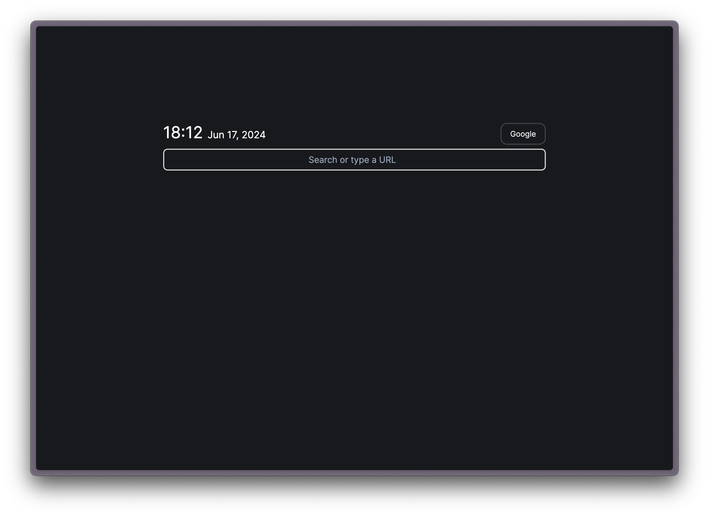

---
# https://vitepress.dev/reference/default-theme-home-page
layout: home

hero:
  name: "SparkHome"
  text: "The final browser homepage."
  tagline: Everything you want, in a magic searchbox.
  actions:
    - theme: brand
      text: Get started
      link: /intro
    - theme: alt
      text: Doc
      link: /ref
---

# Why SparkHome?

## Simple UI

SparkHome's intuitive design creates a seamless user experience, allowing you to effortlessly access all the information and resources you need from one place. The sleek and modern interface features a simple search box that becomes your one-stop place for navigating the web, getting answers to questions, and leveling up your productivity with our powerful toolbox.

