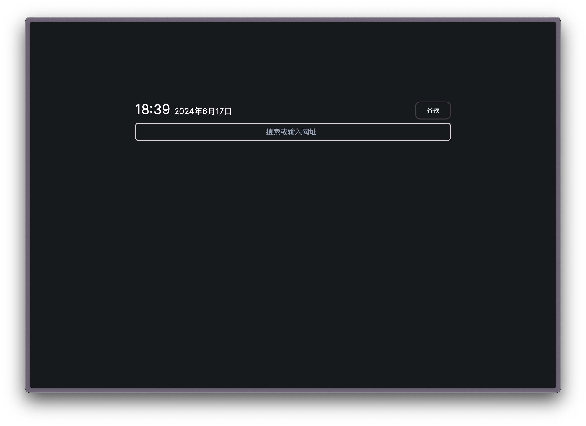
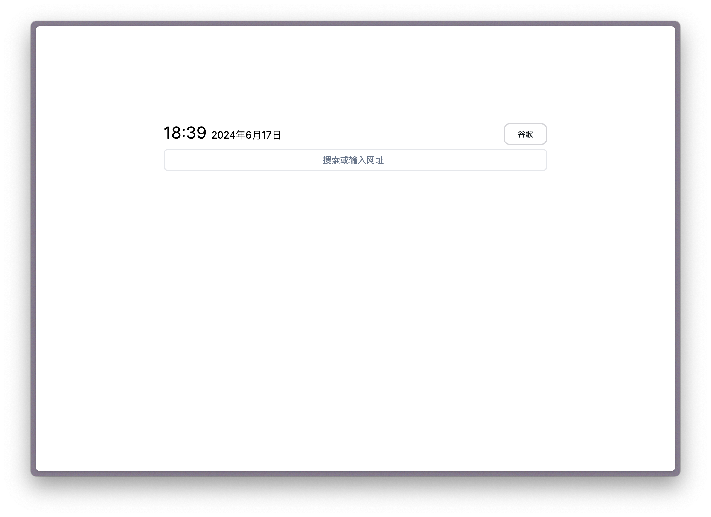

---
# https://vitepress.dev/reference/default-theme-home-page
layout: home

hero:
  name: "星火主页"
  text: "你的终浏览器主页."
  tagline: 想要的一切，尽在一个搜索框中
  actions:
    - theme: brand
      text: 即刻开始
      link: ./intro
    - theme: alt
      text: 文档
      link: ./ref
---

# 我们的优势

## 极简的界面

SparkHome 的直观设计打造出无缝的用户体验，让你可以毫不费力地从一个地方访问到所有需要的信息和资源。其精致现代的界面设计了一个简易的搜索框，成为您一站式解决网络导航、获取问题的答案和利用我们强大的工具箱提高生产力的地方。

